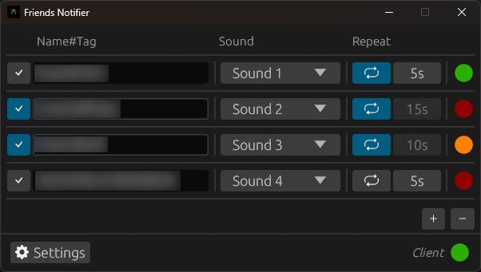

# LoL Friends Notifier

LoLFriendsNotifier is a lightweight application for League of Legends that helps you keep track of your friends by notifying you when they come online.  
You can see their status from the application, receive sound notifications and a native windows notification whenever they come online.

### Features

- Track up to 10 friends at once
- View their online/offline status from this application
- Get notified when a friend comes online with:
  - Native Windows notification
  - One of 13 selectable sounds
- Customize per-friend settings:
  - Assign a different sound for each friend
  - Enable repeated reminders every X seconds

 

    

### Get Started

You can download the latest release from [here](https://github.com/Guido30/LoLFriendsNotifier/releases).
